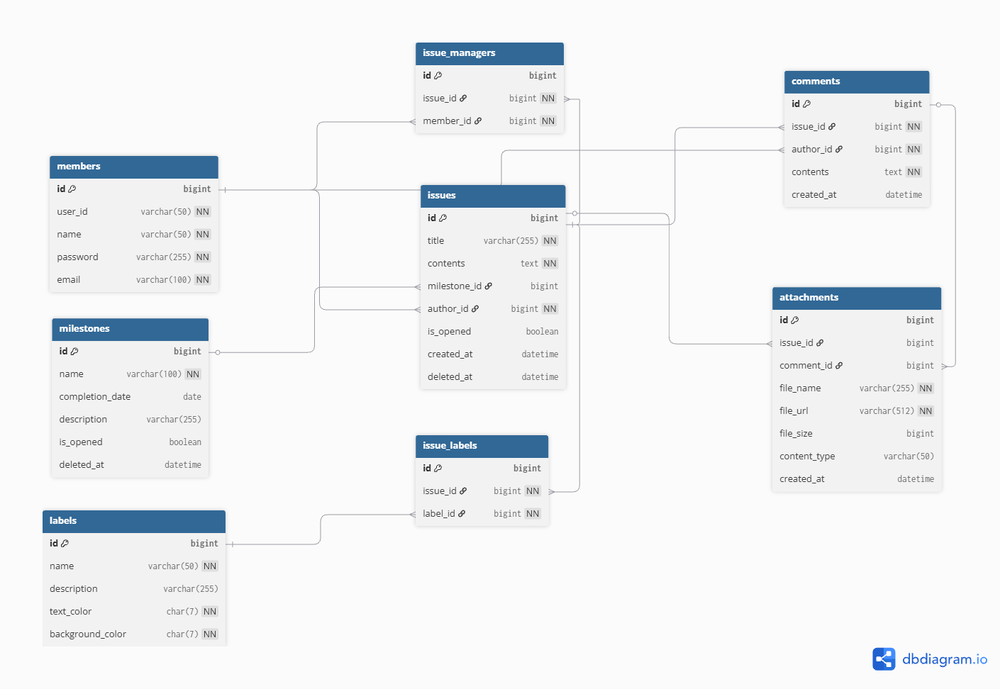

# Project Issue Tracker

## 팀원 소개
### ● Wanja
#### BackEnd/FrontEnd | @LeeWanJa

### ● Hana
#### BackEnd/FrontEnd | @SSongWJ00

---

## 협업 전략
### main: 배포 가능한 안정된 브랜치.
### team01: upstream 으로 PR 보내는 브랜치
### feat-도메인-기능: 특정 도메인의 기능 개발 브랜치

---

## 그라운드 룰
### ● 오전 10시 이전에 출근
### ● 욕설이나 가시돋힌 말 자제
### ● 모르는 것이 나오면 30분 이상 고민하지 않고 문제 공유하기

---

## 커밋 템플릿
### ● Feat: 새로운 기능 추가
### ● Fix: 버그 수정
### ● Refactor: 코드 리팩토링
### ● Docs: 문서 수정(READEME 등)

---


## 이슈 템플릿

### PR 메세지 양식
```markdown
## 😎 구현 내용

## ☠️ 고민 사항

## 😊 기타
```

---
## 🛠 Tech Stack & Tools

### Backend & Database
#### Language/Framework: Java, Spring Boot, Spring Data JDBC
#### RDBMS: MySQL
#### Security: OAuth 2.0 (Social Login)

### Frontend
#### Language/Library: TypeScript, React
#### Infrastructure & CI/CD
#### Cloud: AWS (EC2, S3)

### Pipeline: GitHub Actions (CI/CD 자동화 구축)
#### Build Tool: Gradle

### Collaboration
#### VCS: GitHub (Git-flow 기반 협업)
#### Communication: Slack (Webhook 연동을 통한 배포 및 이슈 알림 자동화)

---

## 회의록
### GitHub 위키 사용
### [➡️회의록](https://github.com/codesquad-masters2026-team01/issue-tracker/wiki/Meeting%E2%80%90Notes#20260504)

---

## API 명세서
### [Notion](https://www.notion.so/Issue-Tracker-API-3565ff02789e80b285b5dd715e59ad24?source=copy_link)

---

## 🏗️ ERD (Entity Relationship Diagram
### **_자료형은 추후에 지정할 예정_**
